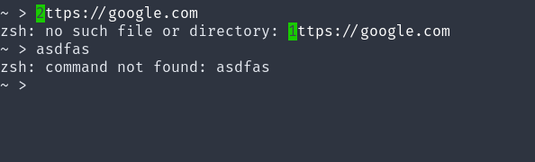
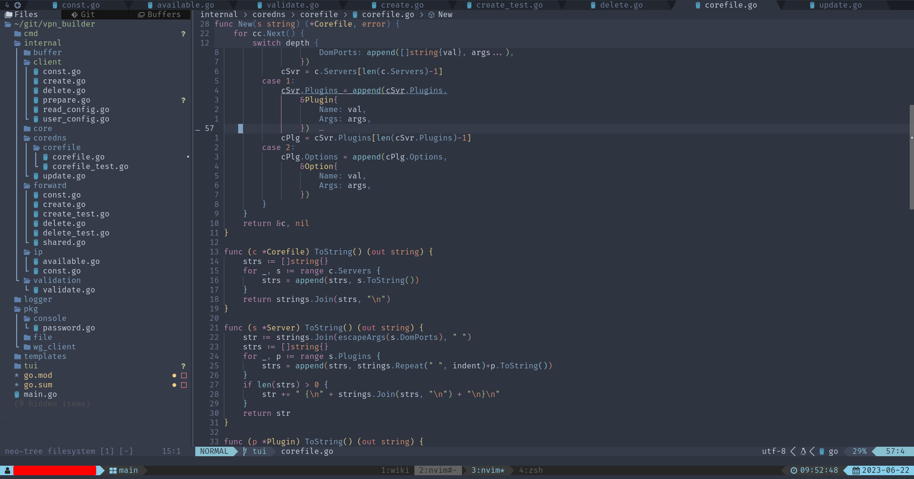
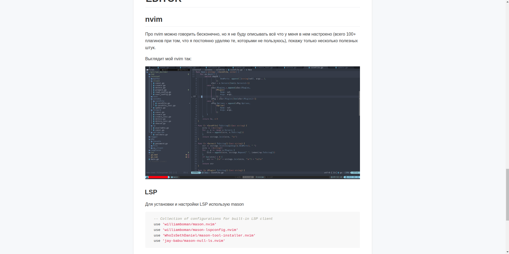
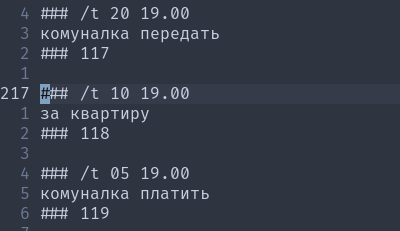
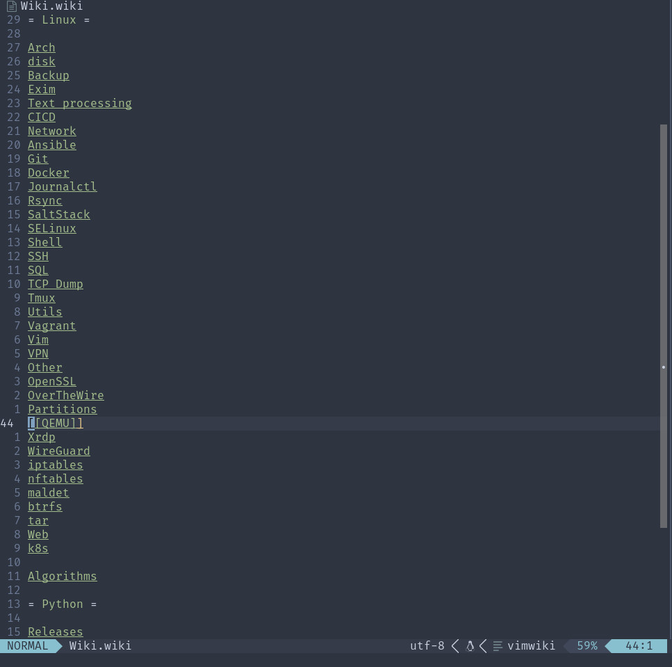

# Терминал
## kitty
Использую только возможность с клавиатуры открывать ссылки. Если нажать ctrl+shift+e, kitty найдет все ссылки на экране и каждой назначит цифру, по нажатию на которую ссылка откроется в браузере.

## tmux
Изначально брал конфиг с этого [репозитория](https://github.com/gpakosz/.tmux), потом многое переделал под себя, но его бинды мне нравятся.
Из полезного советую попробовать monitor-activity и monitor-silence. Когда на вкладке что-то произойдет (или наоборот какое-то время происходить не будет), tmux подсветит эту вкладку (полезно например при долгой компиляции).

В основном я использую tmux так:

Есть сессия с основными вкладками: wiki, расписание на день (об этом в части про nvim), быстрые задачи.

Для каждой долгой задачи новая сессия, переключаюсь между ними через ctrl+q+s (ctrl+q == leader)
## zsh
Использую oh-my-zsh с кучей алиасов, которые там ставятся как плагины. Например: `dcupd -> docker-compose up -d` `kdp -> kubctl describe pods` `kcuc -> kubectl config use-context`

И несколько своих: `v -> nvim` `n -> nnn`

Работаю с set -o vi, при нажатии esc+vv открывается редактор введенной команды в nvim

Input mode: 

Normal mode: 

Visual mode: 

Когда ввожу команду, при нажатии ctrl+k могу дополнить ее, zsh предлагает последнюю введенную

### fzf
Умеет много чего, но я использую только fuzzy поиск введенных команд. Так же можно искать файлы, перемещаться по каталогам и много чего ещё 

Скрин от разработчика:

### z
Простенький bash script, который запоминает каталоги, в которые я перемещался и помогает быстро переходить в них. Например я переместился по `~/ -> ~/demo_project -> ~/main_project -> /var/log/nginx`, теперь если я введу `z demo`, попаду в `~/demo_project`, если введу `z log`, попаду в `/var/log/nginx` и т.д.
### dotcli
Вручную сделанная хранилка dotfiles в git (знаю про разные утилиты для этого, но хотелось обойтись только клиентом гита). По сути это alias:

`alias dotcli='/usr/bin/git --git-dir=$HOME/.dotfiles_cli/ --work-tree=$HOME'`

Под dotcli у меня все конфиги, которые относятся к cli (tmux, zsh, nvim и т.д.), всё лежит в гите и при необходимости можно без проблем перенести настройки на другой ПК просто склонив репозиторий.

Так же к dotcli сделан небольшой CD. Если я что-то поправил в конфигах и запушил в гит, запустится пайплайн, который соберет докер образ arch linux со всем моим окружением и запушит его в мой локальный registry.

Благодаря этому я могу на любом ПК, где есть докер быстро поднять свое окружение и работать с файлами на этом ПК, прокинув их в контейнер. Из недостатков есть то, что образ довольно большой и скачивается пару минут (если в локальной сети с registry, то сильно быстрее), но это происходит из-за того, что у меня в этом образе и python и golang и скомпилированный TreeSitter. Возможно в дальнейшем буду делать отдельные image для python и отдельные для golang.

### httpie
Консольный http клиент. Использую для отладки запросов.

## nnn
Просто удобный файловый менеджер, которым последнее время практически не пользуюсь, но он мне всё ещё нравится.
## bitwarden
Развернут собственный сервер, который доступен только через vpn. В этот список он попал из-за того что у него есть cli клиент, который можно использовать для скриптов. 

Конкретно в моем случае я его использую для подгрузки переменных окружения для terraform. Если мне надо запустить terraform, то перед ним я запускаю команду load_tf, которая является функцией zsh, которая логинится в bitwarden (спросив меня master password) и дальше сохраняет секреты в переменные окружения, которые потом будет читать terraform
# EDITOR
## nvim
Про nvim можно говорить бесконечно, но я не буду описывать всё что у меня в нем настроено (всего 100+ плагинов при том, что я постоянно удаляю те, которыми не пользуюсь), покажу только несколько полезных штук.

Выглядит мой nvim так:



### LSP
Для установки и настройки LSP использую mason

```lua
  -- Collection of configurations for built-in LSP client
  use 'williamboman/mason.nvim'
  use 'williamboman/mason-lspconfig.nvim'
  use 'WhoIsSethDaniel/mason-tool-installer.nvim'
  use 'jay-babu/mason-null-ls.nvim'
```

### git
С гитом работаю в основном из консоли, но также использую [diffview](https://github.com/sindrets/diffview.nvim) для просмотра истории

Для поиска того кто, какую строку правил [git-blame](https://github.com/f-person/git-blame.nvim)

Для отметок и для перемещения между измененными участками кода [gitsigns](https://github.com/lewis6991/gitsigns.nvim) (он умеет и в git blame, но узнал я об этом только что)

### movements
Для быстрого перемещения использую [lightspeed](https://github.com/ggandor/lightspeed.nvim) в режиме Lightspeed_omni_s (почитайте документацию если интересно, объяснить будет сложно)

### markdown
Невероятно удобный [плагин](https://github.com/iamcco/markdown-preview.nvim), для написания .md файлов. При запуске открывает окно браузера, в котором рендерит md страницу, скролит ее вместе с тем, как вы скролите в nvim и всё это работает мгновенно.

Выглядит это так:


### wiki
[vimwiki](https://github.com/vimwiki/vimwiki) - один из моих любимых плагинов, вокруг которого я построил свою работу.

Файлы заметок я храню на всех ПК в `~/.vimwiki` и синхронизирую через syncthing.

В основной своей работе использую в 3 вариантах:

В основной вкладке tmux'a всегда открыто окно с заметками в одной панели и с списком дел на сегодня в другой,
 если нужно что-то найти в wiki, то в окне с заметками через [telescope](https://github.com/nvim-telescope/telescope.nvim) ищу нужную мне запись, читаю/дополняю ее и возвращаюсь на экран с заметками.
 
Для заметок написал свою програмку, с помощь которой можно планировать заметки на определенное время/день/дату и т.д. и уведомление о них прилетит в телеграм. Это приложение я запускаю на телефоне т.к. syncthing у меня настроен на синхронизацию только при подключении к wi-fi, а так я могу внести изменения в заметку на телефоне и уведомление по ней отработает нормально.

Заметки выглядят подобным образом (строки с ### генерируются сами, от меня требуется только писать текст и время. Теги есть разные, не только /t):



План на день это просто daily note с чекбоксами, в которых я отмечаю что планировал сделать и что сделал.

Сама wiki сделана в виде категорий, в которых содержится контент(не очень хорошо структурирована т.к. в основном перемещаюсь через telescope)


# Smartphone

Ещё одной важной частью окружения является смартфон, на котором установлен termux.

На смартфоне работают некоторые скрипты для автоматизации жизни, но к работе отношения не имеющие.

Из полезного на нем стоит аналогичное cli окружение, как и на ПК что позволяет подключаться к нему по ssh и работать с него.

Так же на телефоне есть скрипт, который при нажатии на виджет запустит реверсивный ssh tunnel до моего сервера, пробросив свой ssh порт на него и включит авторизацию по паролю. Таким образом, если вдруг я нахожусь где-то без ноута, то я могу одним нажатием кнопки настроить на телефоне ssh, одолжить у кого-нибудь ПК, подключиться по ssh с паролем к телефону, получить полноценное рабочее окружение с доступ к серверам через vpn, к которому подключен смартфон.
